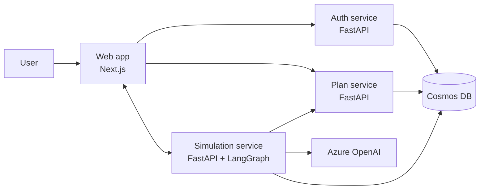

# Myriox

**Built with OpenAI Codex** · OpenAI × NamasteDev Hackathon, July 2026

Myriox is a multi-service simulation platform for stress-testing site plans and user flows
before construction. It models real human intent with persona-driven agents, detects
bottlenecks, and produces cited accessibility and compliance findings from the walk itself.

## At a glance

Use Myriox to:

- draw or trace a floor plan (including tracing directly over an uploaded reference image)
- place doors, ramps, stairs, elevators, and entry and exit points
- run multiple personas through the layout
- watch bottlenecks emerge in real time
- review a compliance report grounded in ADA and IFC clauses

**Try it fast:** the live app ships with a pre-traced demo plan (see `demo/floorplans/`) so
you can run a simulation immediately without drawing a building from scratch first. Bigger
plans and larger persona mixes are fully supported, but each agent reasons via a real LLM
call every tick, so more agents and bigger plans take proportionally longer — see
"Performance" below.

## How it works



1. A user signs up or signs in.
2. The frontend stores the JWT and uses it for API calls.
3. The plan service saves layouts and persona configuration.
4. The simulation service loads the plan, runs persona agents, and streams movement over a
   WebSocket, tick by tick.
5. The final report combines deterministic geometry checks with retrieved building-code
   clauses, cited by ID.

## Models

| Purpose | Deployment | Model | Capacity |
|---|---|---|---|
| Per-tick agent movement reasoning | `agent-reasoning` | `gpt-5.4-mini` | 150 (GlobalStandard) |
| End-of-run compliance report synthesis | `report-synthesis` | `gpt-5.4` | 50 (GlobalStandard) |
| Compliance clause vector search | `text-embedding-3-large` | `text-embedding-3-large` | 100 (Standard) |

`agent-reasoning` stayed on `gpt-5.4-mini` rather than moving to a smaller/faster tier
(e.g. `gpt-5.4-nano`): once the real bottleneck — a heavily under-provisioned deployment
quota throttling concurrent per-tick calls — was fixed by raising capacity, per-call latency
was already low enough (sub-second to ~1.5s per tick in production) that a smaller model
wouldn't have moved the needle, and `mini` reasons more reliably about mobility-profile
constraints than `nano` does. Revisit if agent counts grow much larger.

## Performance

Every agent's move is a real Azure OpenAI call, dispatched concurrently across all active
agents within a tick (not queued one-by-one), and the end-of-run compliance step fans out
one concurrent call per distinct struggle point rather than looping through them serially.
Measured against the live deployment after raising Azure OpenAI capacity (see "Models"
above): a 2-agent run (1 rushed commuter, 1 wheelchair user) on the `library-1885` demo plan
finished in **~17-19 seconds across ~19-23 ticks**; a 14-agent mix across all five personas on
the same plan finished in **~45 seconds across 33 ticks**. Bigger, more open plans with more
agents will still take proportionally longer — this is an inherent tradeoff of giving every
agent a real reasoning step instead of a scripted movement rule, and we'd rather state that
plainly than hide it — but runs no longer approach the multi-minute range for anything close
to a typical demo-sized mix.

## Repository layout

```text
apps/
  web/                Next.js frontend: landing page, dashboard, editor, live simulation UI
  auth-service/       FastAPI email/password auth service
  plan-service/       FastAPI plan CRUD and persona catalog
  simulation-service/ LangGraph simulation engine and compliance auditor
packages/
  mcp-plan-server/    MCP server for plan layout and zone access
  shared-types/       Shared schema definitions for plans and simulation runs
infra/
  bicep/              Azure infrastructure definitions
  scripts/            Provisioning and seeding helpers
demo/
  floorplans/         Real, public-domain floor plans used for testing and the demo video
docs/
  architecture.md     Service map, data flow, and resource inventory
  personas.md         Seed persona behavior model
  building_codes/     Clauses used by the compliance auditor
```

## Features

- Grid editor for drawing walls, doors, ramps, stairs, elevators, service points, and entry
  and exit markers, with an image-overlay mode for tracing over an uploaded reference plan.
- Persona-driven simulation with five seed personas: rushed commuter, wheelchair user,
  parent with stroller, delivery worker, and elderly visitor.
- RAG-backed compliance audit that cites specific ADA and IFC clauses rather than issuing
  vague warnings.
- Multi-tenant data model partitioned by organization.
- MCP plan server for tooling integrations that need plan layouts without depending on the
  authoring path.

## Authentication model

Myriox uses its own email/password flow instead of a third-party auth provider.

- `auth-service` owns the `users` container and exposes signup, login, and profile endpoints.
- Passwords are hashed with bcrypt.
- Successful login returns an HS256 JWT with `sub`, `org_id`, `email`, and `name` claims.
- The same JWT secret is shared with the plan and simulation services.
- The frontend keeps the token client-side and mirrors it into a cookie for navigation guards.

## Local development

Prerequisites:

- Python 3.11+ for the FastAPI services and MCP server
- Node.js 18+ for the web app
- Your own Azure OpenAI + Cosmos DB credentials in each service's `.env` file (see
  "Configuration" below) — none are checked into the repo

Start each service from its own terminal:

### Auth service

```bash
cd apps/auth-service
python3 -m venv .venv && source .venv/bin/activate
pip install -r requirements.txt
uvicorn app.main:app --reload --port 8030
```

### Plan service

```bash
cd apps/plan-service
python3 -m venv .venv && source .venv/bin/activate
pip install -r requirements.txt
uvicorn app.main:app --reload --port 8010
```

### Simulation service

```bash
cd apps/simulation-service
python3 -m venv .venv && source .venv/bin/activate
pip install -r requirements.txt
uvicorn app.main:app --reload --port 8020
```

### Frontend

```bash
cd apps/web
npm install
npm run dev
```

### MCP plan server

```bash
cd packages/mcp-plan-server
python3 -m venv .venv && source .venv/bin/activate
pip install -e .
python server.py
```

When the frontend is running, open http://localhost:3000.

## Configuration

Each service reads its environment from a local file:

- `apps/auth-service/.env`
- `apps/plan-service/.env`
- `apps/simulation-service/.env`
- `apps/web/.env.local`

Those files stay local and are not committed. The shared JWT secret and Azure values must
match across the backend services.

## Azure deployment

The repository already includes the Azure resources used for the demo environment:

- Azure Container Apps for the web, auth, plan, and simulation services
- Cosmos DB for users, plans, runs, agent events, and clauses
- Azure OpenAI for persona reasoning and report synthesis

Reference floor-plan images are currently stored as compressed data URIs inline on the plan
document rather than in blob storage — see the "Known simplifications" note in
[docs/architecture.md](docs/architecture.md) for why, and what a production version would
change.

See [docs/architecture.md](docs/architecture.md) for the as-built resource inventory and
service data flow.

## Re-provisioning infra

```bash
./infra/scripts/provision.sh
source apps/simulation-service/.venv/bin/activate
python infra/scripts/seed_code_clauses.py
```

## Before production

1. Rotate `MYRIOX_AUTH_JWT_SECRET` and update the shared secret everywhere it is used.
2. Move `MYRIOX_ENVIRONMENT` to `production` on the plan and simulation services when
   anonymous browsing should stop.
3. Add service-to-service authentication for internal plan lookups.
4. Move reference-image storage to Azure Blob Storage + CDN instead of inline data URIs.
5. Add a custom domain and TLS.
6. Add billing and scale tuning once real usage patterns are known.

## More detail

- [Architecture overview](docs/architecture.md)
- [Persona definitions](docs/personas.md)
- [ADA clauses used by the auditor](docs/building_codes/ada_clauses.json)
- [Pitch deck PDF](PITCH_DECK.pdf)
