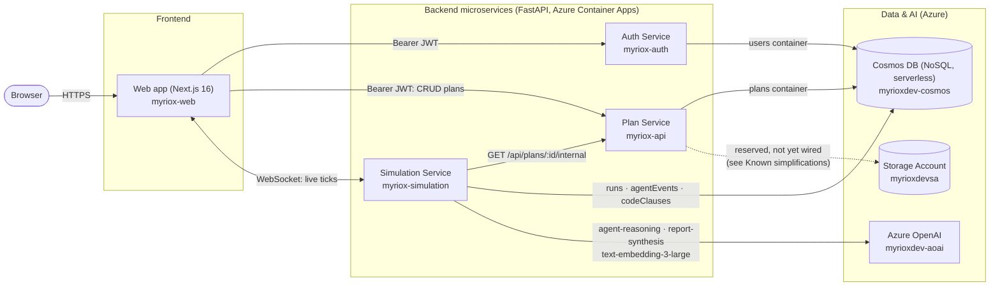
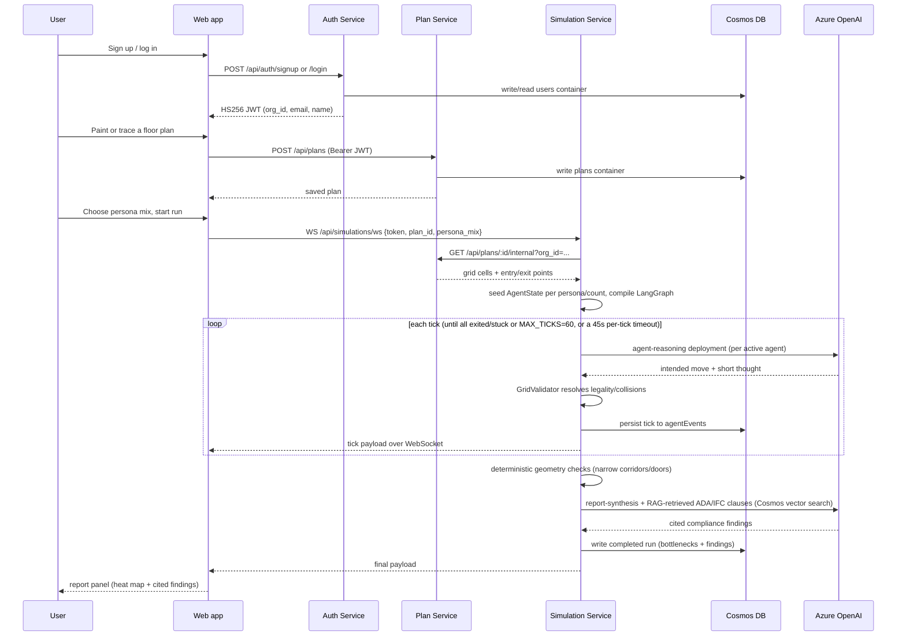

# Architecture

See the top-level `README.md` for a summary and live URLs. This document tracks the
as-built resource names for the dev environment.

## System architecture

## Simulation data-flow sequence

## Services (microservices, not a monolith)

Myriox is split into independently deployable services. Each owns its own Cosmos containers/collections
and talks to the others only over HTTP/WebSocket — never via shared in-process imports.

| Service | Source | Container App | Owns |
|---|---|---|---|
| **Auth Service** | `apps/auth-service` | `myriox-auth` | `users` container (email/password signup+login), issues the shared-secret JWT the other two services verify |
| **Plan Service** | `apps/plan-service` | `myriox-api` | `plans` container (CRUD), the static persona catalog (`GET /api/personas`) |
| **Simulation Service** | `apps/simulation-service` | `myriox-simulation` | The LangGraph agent loop, `runs` + `agentEvents` + `codeClauses` containers, the `/api/simulations/ws` WebSocket, the compliance/RAG auditor |
| **Web app** | `apps/web` | `myriox-web` | Next.js frontend |
| **MCP Plan Server** | `packages/mcp-plan-server` | (run on demand, not yet deployed as a Container App) | Exposes plan tools over MCP for IDE/agent tooling |

Auth is deliberately self-hosted rather than delegated to a third-party provider: the Auth
Service hashes passwords with bcrypt, stores one document per user (id = normalized email,
partitioned by `/email`), and issues an HS256 JWT (`sub`, `org_id`, `email`, `name` claims).
The Plan Service and Simulation Service verify that JWT themselves using a secret shared
only at deploy time (`MYRIOX_AUTH_JWT_SECRET` Container App secret, identical across all
three) — verification never calls back to the Auth Service on the request path.

The Simulation Service never touches the `plans` Cosmos container directly — it calls the
Plan Service's `GET /api/plans/{id}/internal?org_id=...` endpoint (see
`apps/simulation-service/app/services/plan_client.py`). That endpoint is unauthenticated by
JWT (scoped by `org_id` query param instead) because there's no service-to-service auth
(mTLS or a signed service token) yet — see "Known simplifications" below.

The Container App named `myriox-api` was kept from the pre-split monolith to avoid FQDN churn
for the frontend's `NEXT_PUBLIC_API_BASE_URL`; it now runs the `myriox-plan-service` image.

## Azure resources (`rg-myriox-dev`, `eastus2`)

| Resource | Name | Purpose |
|---|---|---|
| Container Registry | `myrioxdevacr` | Hosts `myriox-auth`, `myriox-plan-service`, `myriox-simulation-service`, `myriox-web` images |
| Container Apps Environment | `myrioxdev-cae` | Hosts all container apps |
| Container App | `myriox-auth` | Auth Service (FastAPI), system-assigned identity |
| Container App | `myriox-api` | Plan Service (FastAPI), system-assigned identity |
| Container App | `myriox-simulation` | Simulation Service (FastAPI + LangGraph orchestrator) |
| Container App | `myriox-web` | Next.js frontend |
| Cosmos DB (NoSQL, serverless) | `myrioxdev-cosmos` | `users` (Auth Service, partitioned by `/email`), `plans` (Plan Service), `runs`/`agentEvents`/`codeClauses` (Simulation Service), all partitioned by `/orgId` except `codeClauses` (`/jurisdiction`) |
| Storage Account | `myrioxdevsa` | `plans` blob container for uploaded reference images/exports |
| Key Vault | `myrioxdev-kv` | `cosmos-key`, `openai-key` secrets |
| Azure OpenAI | `myrioxdev-aoai` | Deployments: `agent-reasoning` (gpt-5.4-mini), `report-synthesis` (gpt-5.4), `text-embedding-3-large` — used only by the Simulation Service |
| Log Analytics | `myrioxdev-law` | Container Apps environment logs |

## Data flow (signup through one simulation run)

0. User signs up at `/sign-up` → `POST /api/auth/signup` on the **Auth Service** → a new org
   + user document written to Cosmos `users`, an HS256 JWT returned and stored client-side
   (localStorage + a plain cookie for the Next.js middleware). Every subsequent request to
   the Plan Service and Simulation Service carries this token as `Authorization: Bearer ...`
   (or in-band for the WebSocket, since browsers can't set custom WS handshake headers).
1. User paints a grid in `/dashboard/editor/new` → `POST /api/plans` on the **Plan Service**
   → Cosmos `plans` container.
2. User configures persona mix in `/dashboard/simulations/new` → opens a WebSocket to the
   **Simulation Service**'s `/api/simulations/ws`.
3. `apps/simulation-service/app/services/simulation.py` fetches the plan from the Plan
   Service over HTTP, loads it into a `GridWorld`, seeds `AgentState` per persona/count from
   the plan's entry points, and compiles the LangGraph graph (`app/agents/graph.py`).
4. Each tick: `persona_agents` node calls Azure OpenAI (`agent-reasoning`) once per active
   agent to choose a move + short "thought"; `grid_validator` node resolves legality
   (mobility-profile-aware) and commits the authoritative position.
5. Each tick's agent state is persisted to `agentEvents` and streamed to the frontend, which
   animates dots on the grid via Framer Motion.
6. On completion (all agents exited, stuck, or `MAX_TICKS` reached): deterministic geometry
   checks flag narrow corridors/doors; any remaining "blocked"/"stuck" struggle points are
   summarized and sent to the `report-synthesis` model along with RAG-retrieved ADA/IFC
   clauses (Cosmos native vector search over `codeClauses`) to produce compliance findings.
7. The final `runs` document (bottleneck heat map + compliance findings) is written to Cosmos
   by the Simulation Service and streamed to the frontend's report panel.

## Identity & secrets

The Simulation Service container app uses a system-assigned managed identity with:
- `Storage Blob Data Contributor` on `myrioxdevsa`
- `Cognitive Services OpenAI User` on `myrioxdev-aoai`
- A Cosmos DB SQL role assignment (`00000000-0000-0000-0000-000000000002` = built-in
  *Cosmos DB Built-in Data Contributor*) on `myrioxdev-cosmos`

The Plan Service container app uses the same Cosmos role assignment, scoped to the `plans`
container in practice (both services currently share one Cosmos account/database with
per-service container ownership, not per-service Cosmos accounts).

Cosmos/OpenAI API keys are also stored as Container App secrets (`cosmos-key`, `openai-key`,
sourced from Key Vault) because the LangChain Azure clients currently authenticate via API
key rather than `DefaultAzureCredential` token providers — a good follow-up hardening step
once the app is closer to real production traffic.

## Known simplifications (follow-ups before this is a paid multi-tenant product)

- **Plan Service ↔ Simulation Service auth**: the internal plan lookup endpoint trusts a
  client-supplied `org_id` rather than verifying a forwarded JWT or a signed
  service-to-service token. Fine for a single-tenant dev deployment; not fine once orgs are
  isolated for real. Add mTLS or a short-lived internal service token before GA.
- **`MYRIOX_ENVIRONMENT=development`** is currently set on the Plan Service and Simulation
  Service, which only affects *unauthenticated* requests — they're treated as a shared
  `dev-org` rather than rejected outright, purely so the app is browsable without signing
  in. Any request (HTTP or the WebSocket's in-band token) that carries a real JWT from the
  Auth Service is always fully verified and scoped to the caller's real org, in both
  `development` and `production`. Flip to `production` once anonymous browsing should no
  longer be allowed at all.
- **No password reset / email verification flow yet** — signup issues a session
  immediately; add a verification email and reset-token flow before real users depend on
  their account being recoverable.
- **No team invites** — each signup creates a brand-new single-user organization; there's
  no way yet for a second person to join an existing org.
- **Google OAuth is not wired up** — explicitly descoped for now in favor of a working
  email/password flow with zero external dashboard setup. Clerk or NextAuth are both
  reasonable choices when it's time to add it.
- **Reference-image tracing stores the image inline, not in `myrioxdevsa` blob storage yet**:
  the grid editor's "Upload reference image" control (see README "Simulation flow") compresses
  the upload client-side and stores it as a data URI directly on the plan document
  (`sourceImageBlobUrl` in `packages/shared-types/grid.ts`), capped to stay well under the
  Cosmos 2MB document limit. This was the fastest honest way to ship a working trace-over
  feature without a blob-upload endpoint + SAS token flow + Container Apps redeploy. Move
  large/many images to the reserved `plans` blob container and store a real blob URL in the
  same field once that's built.
